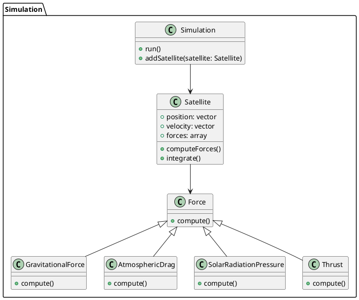

```cpp 
#include <cuda_runtime.h>
#include <vector_types.h>

// for loop


// Host (CPU) implementation of the Satellite class this 
class Satellite {
public:
  float3 position;
  float3 velocity;
  std::vector<Force*> forces;

  __host__ void computeForces() {
    for (auto force : forces) {
      force->compute(this);
    }
  }

  __host__ void integrate(float dt) {
    for (auto force : forces) {
      velocity += force->result * dt;
    }
    position += velocity * dt;
  }
};

// Host (CPU) implementation of the Force class
class Force {
public:
  float3 result;

  __host__ virtual void compute(Satellite* satellite) = 0;
};

// Host (CPU) implementation of the GravitationalForce class
class GravitationalForce : public Force {
public:
  __host__ void compute(Satellite* satellite) {
    // ...
  }
};

// Host (CPU) implementation of the AtmosphericDrag class
class AtmosphericDrag : public Force {
public:
  __host__ void compute(Satellite* satellite) {
    // ...
  }
};

// Host (CPU) implementation of the SolarRadiationPressure class
class SolarRadiationPressure : public Force {
public:
  __host__ void compute(Satellite* satellite) {
    // ...
  }
};

// Host (CPU) implementation of the Thrust class
class Thrust : public Force {
public:
  __host__ void compute(Satellite* satellite) {
    // ...
  }
};

// Host (CPU) implementation of the Simulation class
class Simulation {
public:
  std::vector<Satellite> satellites;

  __host__ void addSatellite(Satellite satellite) {
    satellites.push_back(satellite);
  }

  __host__ void run(int numSteps, float dt) {
    for (int i = 0; i < numSteps; ++i) {
      for (auto& satellite : satellites) {
        satellite.computeForces();
        satellite.integrate(dt);
      }
    }
  }
};

// Device (GPU) implementation of the Satellite class
class SatelliteGPU {
public:
  float3 position;
  float3 velocity;

  __device__ __host__ float3 computeForce(ForceGPU* forces, int numForces) {
    float3 result = make_float3(0, 0, 0);
    for (int i = 0; i < numForces; ++i) {
      result += forces[i].compute(this);
    }
    return result;
  }

  __device__ __host__ void integrate(float3 force, float dt) {
    velocity += force * dt;
    position += velocity * dt;
  }
};

// Device (GPU) implementation of the Force class
class ForceGPU {
public:
  __device__ __host__ virtual float3 compute(SatelliteGPU* satellite) = 0;
};

// Device (GPU) implementation of


c++
Copy code
// Device (GPU) implementation of the GravitationalForce class
class GravitationalForceGPU : public ForceGPU {
public:
  __device__ __host__ float3 compute(SatelliteGPU* satellite) {
    // ...
  }
};

// Device (GPU) implementation of the AtmosphericDrag class
class AtmosphericDragGPU : public ForceGPU {
public:
  __device__ __host__ float3 compute(SatelliteGPU* satellite) {
    // ...
  }
};

// Device (GPU) implementation of the SolarRadiationPressure class
class SolarRadiationPressureGPU : public ForceGPU {
public:
  __device__ __host__ float3 compute(SatelliteGPU* satellite) {
    // ...
  }
};

// Device (GPU) implementation of the Thrust class
class ThrustGPU : public ForceGPU {
public:
  __device__ __host__ float3 compute(SatelliteGPU* satellite) {
    // ...
  }
};

// CUDA kernel to run the simulation on the GPU
__global__ void runSimulationKernel(SatelliteGPU* satellites, int numSatellites,
                                    ForceGPU* forces, int numForces,
                                    float dt, int numSteps) {
  int index = blockIdx.x * blockDim.x + threadIdx.x;
  if (index < numSatellites) {
    SatelliteGPU& satellite = satellites[index];
    for (int i = 0; i < numSteps; ++i) {
      float3 force = satellite.computeForce(forces, numForces);
      satellite.integrate(force, dt);
    }
  }
}
```