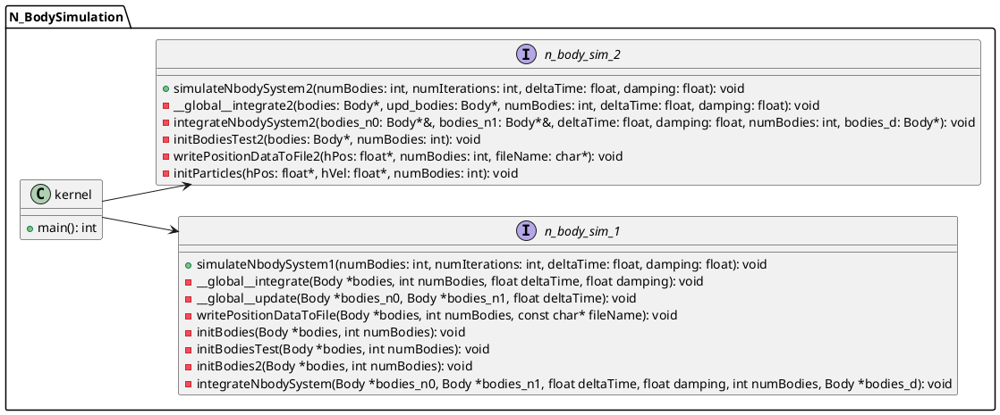

```plantuml
@startuml
left to right direction


package N_BodySimulation {
    
    interface n_body_sim_1 {
        +simulateNbodySystem1(numBodies: int, numIterations: int, deltaTime: float, damping: float): void
        -__global__integrate(Body *bodies, int numBodies, float deltaTime, float damping): void
        -__global__update(Body *bodies_n0, Body *bodies_n1, float deltaTime): void
        -writePositionDataToFile(Body *bodies, int numBodies, const char* fileName): void
        -initBodies(Body *bodies, int numBodies): void
        -initBodiesTest(Body *bodies, int numBodies): void
        -initBodies2(Body *bodies, int numBodies): void
        -integrateNbodySystem(Body *bodies_n0, Body *bodies_n1, float deltaTime, float damping, int numBodies, Body *bodies_d): void
    }

    class kernel {
        +main(): int
    }
    
    interface n_body_sim_2 {
    +simulateNbodySystem2(numBodies: int, numIterations: int, deltaTime: float, damping: float): void
    -__global__integrate2(bodies: Body*, upd_bodies: Body*, numBodies: int, deltaTime: float, damping: float): void
    -integrateNbodySystem2(bodies_n0: Body*&, bodies_n1: Body*&, deltaTime: float, damping: float, numBodies: int, bodies_d: Body*): void
    -initBodiesTest2(bodies: Body*, numBodies: int): void
    -writePositionDataToFile2(hPos: float*, numBodies: int, fileName: char*): void
    -initParticles(hPos: float*, hVel: float*, numBodies: int): void
    }
    
    kernel --> n_body_sim_1
    kernel --> n_body_sim_2

    
}

@enduml
```

