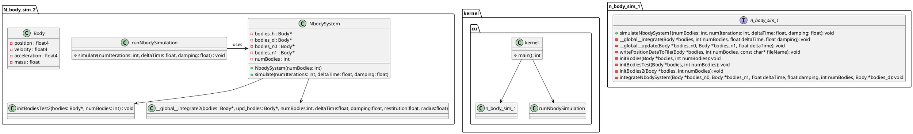

```plantuml
@startuml


package kernel.cu {
    


    class kernel {
        +main(): int
    }

    kernel --> n_body_sim_1
    kernel --> runNbodySimulation

}

package N_body_sim_2 {
    

    class Body {
        - position : float4
        - velocity : float4
        - acceleration : float4
        - mass : float
    }


    class NbodySystem {
        - bodies_h : Body*
        - bodies_d : Body*
        - bodies_n0 : Body*
        - bodies_n1 : Body*
        - numBodies : int
        + NbodySystem(numBodies: int)
        + simulate(numIterations: int, deltaTime: float, damping: float)
    }

    NbodySystem --> "initBodiesTest2(bodies: Body*, numBodies: int) : void" 
    NbodySystem -->"__global__integrate2(bodies: Body*, upd_bodies: Body*, numBodies:int, deltaTime:float, damping:float, restitution:float, radius:float)"

    class runNbodySimulation {
        +simulate(numIterations: int, deltaTime: float, damping: float) : void
    }

    runNbodySimulation-> NbodySystem : uses
    
}

package n_body_sim_1{
        interface n_body_sim_1 {
        +simulateNbodySystem1(numBodies: int, numIterations: int, deltaTime: float, damping: float): void
        -__global__integrate(Body *bodies, int numBodies, float deltaTime, float damping): void
        -__global__update(Body *bodies_n0, Body *bodies_n1, float deltaTime): void
        -writePositionDataToFile(Body *bodies, int numBodies, const char* fileName): void
        -initBodies(Body *bodies, int numBodies): void
        -initBodiesTest(Body *bodies, int numBodies): void
        -initBodies2(Body *bodies, int numBodies): void
        -integrateNbodySystem(Body *bodies_n0, Body *bodies_n1, float deltaTime, float damping, int numBodies, Body *bodies_d): void
    }
}
@enduml

```

